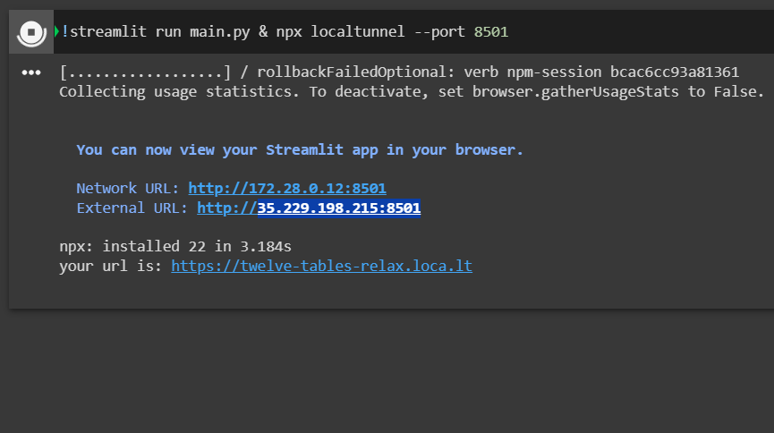
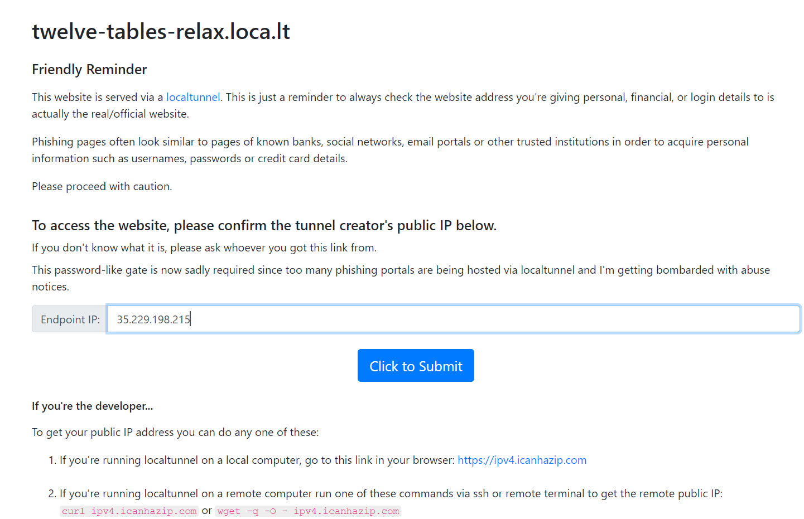
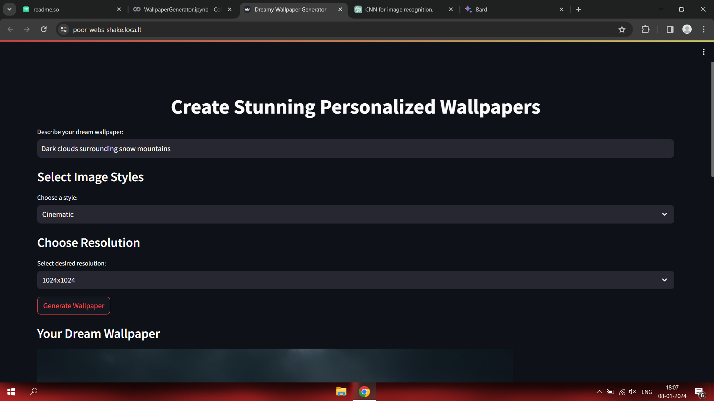
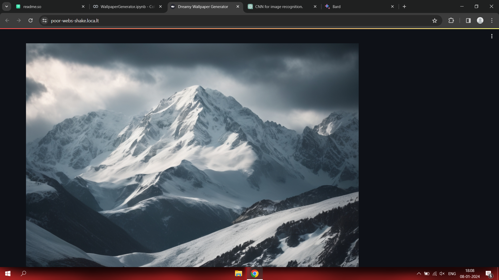

# Dreamy Wallpaper

✨ Dream up, design, download. Create stunning, personalized wallpapers with ease using AI. Choose from diverse styles, customize resolutions, and bring your desktop to life—all in a few clicks.

## Features

**AI-Powered Generation:** Harness the power of diffusion models to create unique, high-quality wallpapers.

**Personalized Styles:** Explore a variety of artistic styles to match your aesthetic.

**Customizable Resolutions:** Choose the perfect resolution to fit any device.

**Effortless Creation:** Generate breathtaking wallpapers with just a few simple prompts.

**Endless Inspiration:** Unlock a universe of creative possibilities with every click.

## Tech Stack

**Python**

**Streamlit**

**HuggingFace**

**Diffuser**

**Google Colab**

## Run Locally

Download the Colab Notebook

Make Sure to Run the Notebook in **GPU** runtime

To run streamlit in colab.
Run the last cell

Copy the highlighted ipv4 address and open the last link from the output

paste the copied address, remove the port number and press submit

## Screenshots

